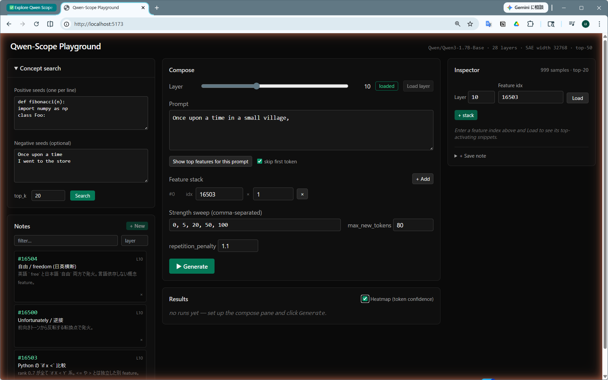
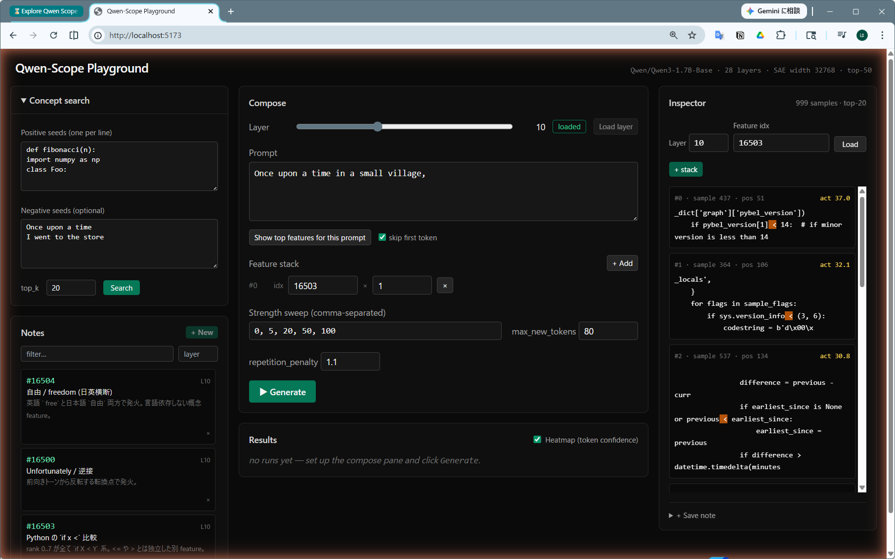
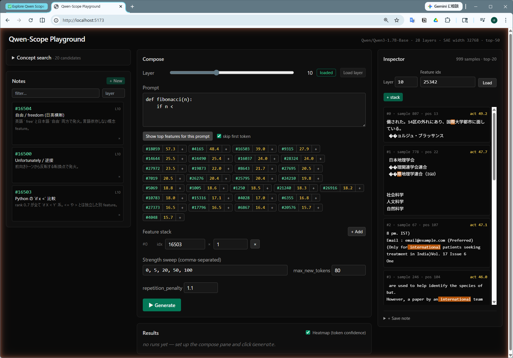
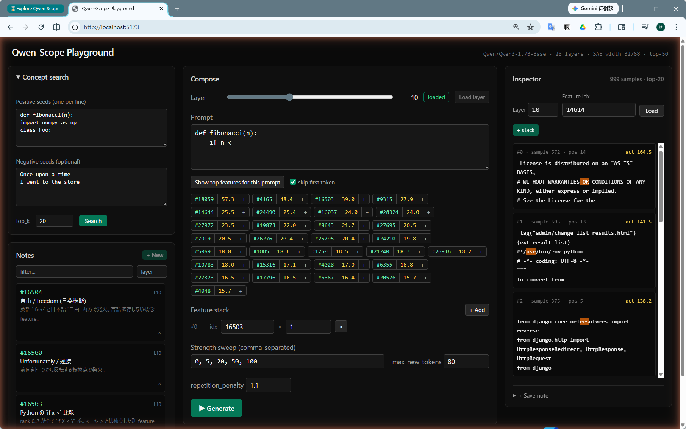
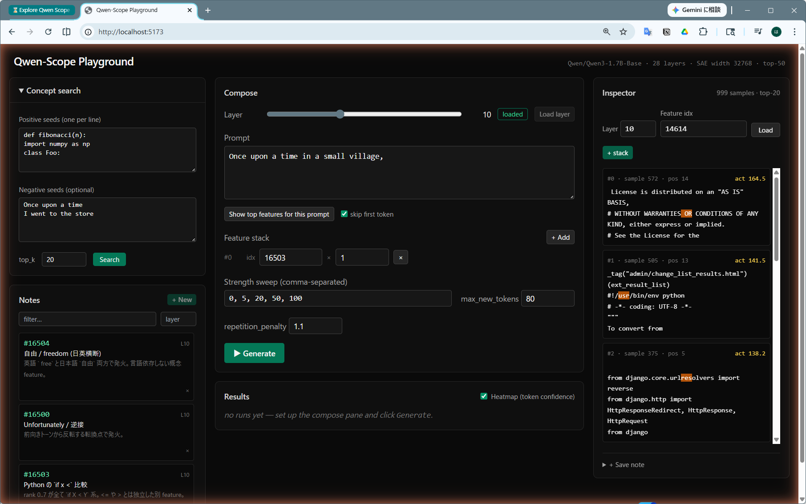
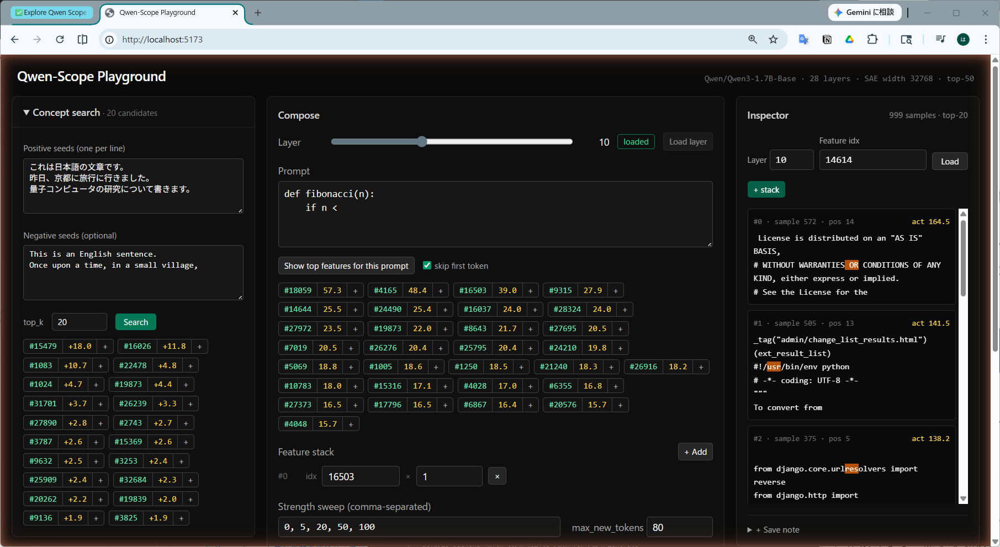
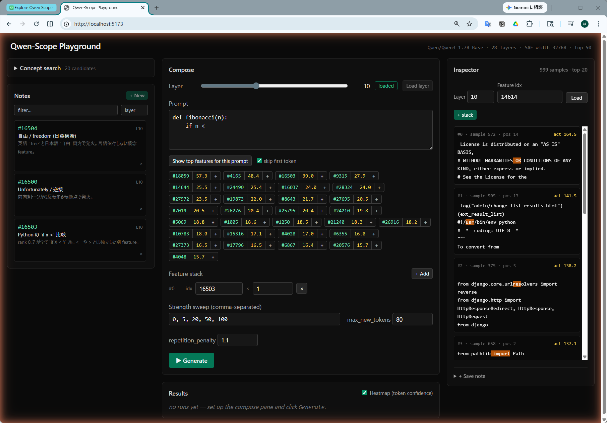
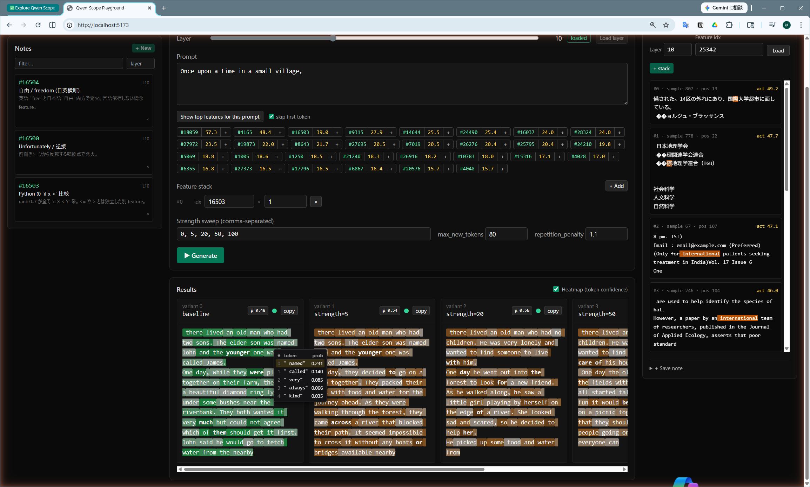

# Qwen-Scope Web Playground — ハンズオンツアー原稿

ローカル PC (RTX 3090) で動かす Qwen-Scope Web Playground を、**いろいろな機能をひととおり触ってみる** ためのハンズオン原稿。**本編 §2〜§7.5 で 30〜40 分** ほど一周する想定。**§1 は初回セットアップ + コーパス mining(~30 分)** が含まれるので、初回通読は計 1 時間ちょい。深掘りしたい人向けの **§9 発展編は ~90 分のオプション枠**。

「SAE feature って何が嬉しいの?」という疑問から始めて、Inspector で feature の意味を覗く → プロンプトから feature を釣る → 概念から逆引きで feature を探す → Notes に名前を付ける → 見つけた feature で物語を steering する → Heatmap で確信度の動きを観測する、まで触る。

実行環境: Qwen3-1.7B-Base + SAE-Res-W32K-L0_50, layer 10, RTX 3090。各章には実走時に観察した具体例を本文として埋めてある。

---

## 0. このツールが解こうとしていること

Qwen3-1.7B-Base の中央付近の層 (今回は layer 10) で、モデルは **2048 次元の dense なベクトル** を抱えて次の処理に進む。これを **SAE (Sparse Autoencoder)** で **32768 次元のスパースなベクトル** に分解する。32768 個の各次元 = **feature** で、ある特定の概念が文脈に出てきたときだけ強く発火する「概念検出器」になっている、というのが SAE 研究の仮説。

このツールはその 32768 個の検出器を 3 つの方法で扱う:

- **Inspector**: ある番号の feature が「どんな文に最も強く反応したか」を用例で確認する
- **Concept search**: 「コードっぽさ」のような概念から **逆引き** で feature を探す
- **Steering**: 任意の feature を **強制的に発火** させた状態で生成し、出力への影響を見る

これに「**Show top features**(プロンプトから feature を正引き)」と「**Notes**(発見した feature を永続保存)」が乗って、`番号 → 用例 → 概念名 → ノート → steering` のループが UI 内で回るようになっている。

---

## 1. 起動

### 1.1 初回セットアップ(初回のみ・~5 分)

リポジトリを clone した直後の初回だけ必要な準備。2 回目以降のセッションは §1.2 の `uvicorn` / `pnpm dev` だけで起動できる。

```bash
# Python 3.12 の venv を作って依存をインストール
uv venv --python 3.12
source .venv/Scripts/activate    # Windows bash の場合。PowerShell は .venv\Scripts\Activate.ps1
uv pip install -e ./backend       # FastAPI / transformers / datasets 等

# フロントエンドの依存
cd frontend && pnpm install && cd ..
```

`uv` が無い場合は事前に `winget install astral-sh.uv` (Windows) 等で入れる。GPU は CUDA 12.x ドライバ必須(`nvidia-smi` で確認)。

### 1.2 サーバ起動

```bash
# ターミナル 1: バックエンド
uvicorn backend.main:app --reload --port 8000

# ターミナル 2: フロントエンド
cd frontend && pnpm dev   # http://localhost:5173
```

初回は Qwen3-1.7B-Base (~3.4 GB) の HF cache ダウンロードが入るので追加で 1〜2 分。バックエンドの起動完了は `INFO: Application startup complete.` のログ + `curl http://localhost:8000/api/health` が `{"ok":true}` を返すことで確認できる。

### 1.3 3 ペイン UI の地図

ブラウザで `http://localhost:5173` を開くと 3 ペイン構成 (Discover / Compose+Results / Inspector) が出る。



*起動直後の状態。左 Discover (Concept search + Notes)、中央 Compose+Results、右 Inspector。Results ヘッダ右端の「Heatmap (token confidence)」チェックボックスは §7.5 で使う。*

```
┌─ Discover ─────┬─ Compose ──────────┬─ Inspector ─┐
│ Concept search │ Layer / Prompt     │ idx 入力    │
│  └ chips       │ Show top features  │ snippets    │
│                │  └ chips           │             │
│ Notes (saved)  │ Feature stack ◄──┐ │ + Save note │
│  └ rows        │ Strength / Gen   │ │             │
└────────────────┴──────────────────┘─┴─────────────┘
                          ↑
       Discover/Show top の chip の "+" で流入
```

役割は **発見 → 実験 → 検算**。左ペイン (Discover) で feature を見つけ、中央 (Compose) の Feature stack に投入して Generate、右ペイン (Inspector) で意味を検算する。

### 1.4 コーパス mining(初回のみ・~30 分)

Inspector と Concept search が「数字 → 意味」の翻訳をするには、**事前にコーパスを 1 回流して各 feature の代表用例を集めておく** 必要がある。**バックエンドを一旦止めてから**(GPU を取り合うため)mining を走らせる:

```bash
# uvicorn を Ctrl+C で停止してから
uv run --python .venv/Scripts/python.exe -m backend.corpus_mine \
    --layer 10 --num-samples 24000
```

既定で **英語の教育コンテンツ (fineweb-edu) / Python コード (codeparrot) / 日本語 Wikipedia** を 1:1:1 でミックスして流し、各 feature の上位活性 snippet を保存する。RTX 3090 で **25〜35 分**。完了すると `backend/data/corpus.db` (~80 MB) が出来る。終わったらバックエンドを再起動 → ブラウザをリロードすると Inspector ヘッダに `24000 samples · top-20` が出る。

「ちょっと試したいだけ」なら `--num-samples 3000` で 3〜5 分でも動く(ただし Concept search の精度はだいぶ落ちる)。本格的に探索を回すなら 24000 が最低ライン、もっと精度を上げたい場合は §9(発展編)を参照。

---

## 2. Inspector で feature 16503 を覗く

**1 個の feature の意味を、自分の目で確かめる** 体験から始める。

### 操作

1. 右ペインの Inspector で `Layer = 10` / `Feature idx = 16503` を入力
2. `Load` を押す

### 観察

8 件の上位 snippet が縦に並ぶ。`[[X]]` は黄色ハイライト = 活性ピーク位置。



*Inspector ペインに feat 16503 の上位 snippets。`if pybel_version[1]【<】 14:` / `if sys.version_info【<】 (3,` / `if previous【<】 earliest_since:` ……すべて Python の `if X < Y` パターン。*

```
rank=0  act=44.3
  PageNotAnInteger('That page number is not an integer')
        if number[[ <]] 1:
            raise EmptyPage('That page number is less than 1...')

rank=1  act=43.6
  def fib(n):
      if n[[ <]] 2:
          return n
      return fib(n - 1) + fib(n - 2)

rank=2  act=40.7
  def fromtimestamp(cls, timestamp, tzinfo=None):
      if timestamp[[ <]] 0:
          raise OSError('[Errno 22] Invalid argument')

rank=3  act=40.6
  # for 8-bit serial transport
  def derez(x):
      if( x[[ <]] 90 ):
          return (-90-x)/2

rank=4  act=40.4
  if quarter[[ <]] 3:
      mask_t4or5 = str(year+4)

rank=5  act=40.2
  if n[[ <]] 0 or n >= self.length:
      raise IndexError("Index out of range")

rank=6  act=40.1
  hz_pos = hz
  if hz_pos[[ <]] 0:
      hz_pos = 0

rank=7  act=40.0
  if date[[ <]] time.strftime("%Y-%m-%d"):
      return False
```

### 解釈

8 件中 8 件が Python コードで、活性ピークは **すべて `<` トークン**。`if 変数 < 数値/別変数:` のパターンに専ら反応している。

驚くべきは粒度。`<=` や `>` ではなく **`<` 専用**、しかも `for i in range(n)` のような数値リテラルではなく **「変数 `<` 何か」のループ条件**。SAE は「比較演算子全般」を 1 つの feature にまとめず、`<` を独立に切り出している。

---

## 3. 「16503 の隣」を覗いて feature の独立性を体感する

「番号が近い feature は意味も近いのか?」を確かめる。Inspector で `idx` だけ変えて Load を押すのを 4 回繰り返す。

### 観察

| idx | 活性 | 上位 snippet (黄色ハイライトのトークン) | 概念仮説 |
| --- | --- | --- | --- |
| 16500 | 50.4 | "...flows between mobile devices and the corporate network.\n[[Unfortunately]], there isn't one single magic fix..." | 転換語 "Unfortunately"(否定的トーンへの切り替わり) |
| 16504 | 34.0 | "...cyberspace to remain open and[[ free]]..." / 日本語側で "[[自由]]主義 社会主義..." | **「自由 / freedom」**(英語 ` free` と日本語 `自由` の両方で発火する **日英横断 feature**) |
| 16510 | 27.6 | "...The foal respects the mare, but is also bonded to her and[[ trusts]] her..." / "Head Pressing in Dogs ... compuls..." | 動物の心理・行動(`trusts`, `compuls(ive)` などが上位) |
| 0     | 10.2 | "...The system as recited in 21. The system as recited in[[\n]]22. The system as recited in 23..." | 特許の請求項 (Claim) の **項目区切り改行** という極めて狭い用途。コーパスを 24 倍に増やしてようやく top に入った稀少 feature |

### 解釈

連続する 4 つの番号 (16500, 16503, 16504, 16510) で **完全に無関係な概念** が出てきた。SAE feature の番号は意味的にソートされていないので、**番号順に眺めても辞書として機能しない**。だから Concept search や Show top features のような **検索手段が必要** になる。

特に **feat 16504** は今回の発見の収穫で、英語の ` free` と日本語の `自由` の両方を同じ feature が捉えている。これは「概念は言語に依存しない」と言われる SAE の性質を、自分の目で確認できた事例。

idx=0 は前回の小さいコーパス(1000 サンプル)では用例 0 件だった「dead feature」と判定したが、今回の 24000 サンプルで **特許の請求項の項目区切り改行** という極めて狭い用途で発火することが判明した。SAE の「死にかけ feature」と「真に死んだ feature」の区別はコーパスの量で動くので、こういう判定はサンプル数を念頭に置く。

---

## 3.5 feature の粒度ギャラリー — 16503 だけじゃない、ナローな feature たち

§3 で「**番号近傍が意味的に無関係**」を見た。では番号空間を **遠くまで** 眺めると、どんな粒度の feature が並んでいるのか。corpus.db を直接 SQL で叩いて、register / BOS 系のノイズ feature(token 位置 0〜2 で常時発火するやつ)を除外した 27000+ の概念 feature から、**SAE の粒度の幅** をよく示す 6 個を並べる。

### G-1. feat #28927 (`for`) と feat #1419 (`in`) — 構文を 2 つの feature で分業

```
[CODE] params = {}\n   【 for】 key in args:                            (act 52.5)
[CODE] for line【 in】 output.splitlines():                              (act 47.6)
```

両方とも Python コード以外では発火せず、**cv=0.02** という極めて低分散。`for X in Y:` という 1 つの構文を、SAE は **`for` 用 feature と `in` 用 feature の合成** として表現している。1 つの「for-in 構文 feature」にまとめ上げず、トークン単位で分業する。

### G-2. feat #2371 — `from __future__ import` の `future`

```
[CODE] # -*- coding: utf-8 -*-\nfrom __【future】__ import absolute_import (act 98.8)
```

Python 互換性 import の **5 文字語 1 つ** にだけ専属する feature。「Python キーワード」のような大括りではなく、`__future__` という非常に狭いお作法の中の特定単語が独立した番号を持っている。32768 個もあれば、ここまで局所的なものまで割り振れる。

### G-3. feat #6460 — ライセンス文脈の `the`

```
[CODE] to deal\nin【 the】 Software without restriction                  (act 54.1)
[CODE] received a copy of【 the】 GNU General Public License             (act 52.6)
```

英語で最頻出の `the` だが、この feature は **GPL / MIT などのライセンス boilerplate 中の `the`** にだけ反応する(`the Software` / `the License` 等)。**同じ単語でも register / genre で別 feature が割り当てられる**。SAE が「意味」より「文脈」で feature を切る瞬間。

### G-4. feat #7690 ・ feat #20262 ・ feat #17402 — 日本語の機能語が個別 feature に

```
feat #7690 (助詞「を」)
  ミニパラダイムは逆に混迷【を】深めた。                                 (act 45.1)
  産業地理学（農業【を】扱う農業地理学、                                  (act 44.7)

feat #20262 (助詞「に」)
  消えてしまった地形【に】適合していたにすぎない                          (act 43.9)

feat #17402 (読点「、」)
  地理学は【、】大きく系統地理学と地誌学に                                (act 21.8)
```

すべて cv ≤ 0.02。**「を」「に」「、」がそれぞれ独立した feature** として SAE の中に存在する。tour §5 で「日本語の助詞」をひとつの概念として釣り上げたが、その実体は **個別の助詞 feature の集合**。日本語の助詞は意味的役割(目的格・場所格)が異なるので、それぞれ独立しているのが文法的にも自然。

### G-5. feat #25342 — 「国際 / international」(cross-lingual)

```
[JA] 国【際】地理学連合（IGU）                                          (act 47.7)
[EN] (Only for【 international】 patients seeking treatment in India)    (act 47.1)
```

§3 で観察した feat 16504(`自由 / freedom`)と同じく、**漢字 1 字「際」と英単語 ` international` が同じ feature 番号** で発火する。「概念は言語に独立」の追加実証。同様に feat #14120 (経済 / economic) も EN+JA 横断で立つ。



*Inspector で feat 25342 を Load。日本語 Wikipedia の `国【際】地理学連合（IGU）` と英語の `(Only for【 international】 patients...)` が同じ feature の上位に並ぶ。漢字 1 字とアルファベット 1 単語が「同じ概念」として同居している。*

### G-6. feat #18310 — 「イスラム」のうち「ム」だけが立つ

```
[JA] アラブ世界、イスラ【ム】世界の一国である。                         (act 53.5)
[JA] 主に信仰されるイスラ【ム】教がある。                                (act 52.2)
```

「イスラム」を Qwen のトークナイザが **「イスラ」+「ム」** と切るため、SAE feature も「ム」の位置に乗る。「イスラム」全体を 1 feature で捉えたい直感はあるが、SAE は **トークナイザが切ってきた境界の上に乗っているだけ** で、それより細かい単位では feature を持てない。**SAE 解釈はトークナイザ設計に強く依存する** ことを思い出させる例。

---

これだけ見ても **「番号近傍に意味の関係性は無く、全体としては超ナロー〜横断概念まで多様な粒度が共存している」** ことが分かる。本章で挙げた 6 個は corpus.db から発掘した一部で、より体系的な探索結果は `feature_findings.md` に残してある。次は **自分の興味あるプロンプトに反応する feature を釣り上げる** 機能 (Show top features) に進む。

---

## 4. Show top features — プロンプトに反応する feature を一覧する

これまでは、feature の番号をこちらから指定して Inspector で覗いてきた(§2、§3)。**Show top features** はその逆方向の機能で、**プロンプトを書くと、その文を読んだときに立つ feature を活性値順にリストしてくれる**。32768 個の feature の中から、いま自分が steering しようとしている文脈に **関与している feature** だけが浮かび上がる。

### 操作

1. Compose の Prompt に下記を入力
   ```
   def fibonacci(n):
       if n <
   ```
2. `[skip first token] ✓` は ON のまま(先頭トークンは外れ値が出やすいので落とす)
3. `Show top features for this prompt` をクリック

### 観察

下に chip が 30 個ほど並ぶ。各 chip は **`#idx (max_activation)`** の形:



*`def fibonacci(n):\n    if n <` の入力に対する候補 chip。1 行目に `#18059 57.3 +`、`#4165 48.4 +`、**`#16503 39.0 +`**、`#9315 27.9 +`、`#14644 25.5 +` …と並ぶ。各 chip の右端の `+` をクリックすると Feature stack に追加される。*

| chip      | max_act |
| --------- | ------- |
| #18059    | 57.3    |
| #4165     | 48.4    |
| **#16503** | **39.0** |
| #9315     | 27.9    |
| #14644    | 25.5    |

`max_activation` は「**このプロンプト全体を流したときの、その feature の最大活性値**」。

ここで嬉しいのが、§2 で「**Python の `if x <` 比較**」だと確かめた **feat 16503** が 3 位に出てくること。chip にホバーすると `peak: pos 6 " <"` という tooltip が出て、プロンプト末尾の `<` トークンでこの feature が立ったことが確認できる。chip の `#16503` 部分をクリックすれば Inspector が開き、§2 で見たのと同じ `if X < Y` の用例が並ぶ。

つまり Show top features の使い方は:

```
プロンプトを書く → 候補 chip が並ぶ → Inspector で意味を確かめる → 気に入った feature を + で stack に追加
```

「**32768 個から効きそうな番号を当てずっぽうで探す**」のではなく、「**自分が steer したい文脈の方からあぶり出す**」ための入口。

### 注意: 上位 = 概念 feature とは限らない

別のプロンプト(例: `Once upon a time in a small village,`)で試すと、idx **14614** が max_act=137.9 で 1 位に来る。chip だけ見ると「これは物語の冒頭を捉える feature か?」と思いそうだが、`#14614` をクリックして **Inspector で確かめてみる** と:

```
rank=0 act=164.5  PEAK=' OR'      License BASIS, WITHOUT WARRANTIES OR
rank=1 act=141.5  PEAK='usr'      #!/usr/bin/env python
rank=2 act=138.2  PEAK='res'      django.core.urlresolvers
rank=3 act=137.9  PEAK=' a'       reads steps one at a time
rank=4 act=137.1  PEAK=' import'  from pathlib import Path
rank=5 act=137.1  PEAK='c'        Copyright (c) Microsoft
…
```

コーパスでの peak token が `OR` / `usr` / `res` / ` a` / ` import` / `c` …とまるで揃わず、活性値も 134〜165 の狭い範囲に張り付いている。これは「**何にでも 135 程度で機械的に発火する**」**register feature**(概念を持たない常時発火型)で、物語の冒頭という意味は捉えていない。



*Inspector で feat 14614 を Load。peak token は `OR` / `usr` / `res` ……と無関係、各 snippet の内容も License 文・shebang・Django import とバラバラ。これが register feature のサイン。*

register feature を見抜く目印は 2 つ:

- Inspector で **上位 10 件の peak token がバラバラ**
- Inspector で **活性値が rank 0〜9 までほぼ同じ**(代表的な「際立った用例」が無い)

つまり Show top features の chip 上位 = そのまま「概念担当の feature」ではない。**chip は「候補リスト」、概念の確定は必ず Inspector** という二段構えで使う。これは §5(Concept search)も同じ作法。

---

## 5. Concept search で抽象的な概念から逆引き

§4 が「プロンプト → そこに反応する feature」だったのに対し、Concept search は「**抽象的な概念 → それに対応する feature**」の逆引き。コーパスに含まれるどの feature が、その概念をうまく分離するか?を score 順にランクづけしてくれる。

操作: 左ペイン (Discover) の上半分にある **Concept search** に positive seed(その概念に当てはまる文)と negative seed(当てはまらない文)を改行区切りで入れる → `Search` → 上位 chip の `idx` を **右ペイン (Inspector) で開いて意味を検算** → 採用したい feature は chip の `+` で **中央の Feature stack に投入** → Generate で steering 実験へ。

つまり Concept search は **発見、Inspector は検算、Compose の Feature stack は実験投入** という役割が画面の左→右で完結する。

本ハンズオンでは 2 つのお題で試して、上位 5 件すべて Inspector で確認した結果を表に入れている。

### A. 「日本語の文章っぽさ」

- positive: `これは日本語の文章です。` / `昨日、京都に旅行に行きました。` / `量子コンピュータの研究について書きます。`
- negative: `This is an English sentence.` / `Once upon a time, in a small village,`



*Discover ペイン上半分の Concept search に positive/negative seeds を入れて Search。下に `#15479 +18.0`、`#16026 +11.8`、`#1083 +10.7` …と score 順に chip が並ぶ。`+` で stack、idx クリックで Inspector に展開。*

| rank | idx    | score   | Inspector で見えた概念 |
| ---- | ------ | ------- | ---------------------- |
| 0 | 15479 | +17.97 | **日本語の内容語** (`句` / `実` / `助け` / `全` などの漢字・ひらがな複合に発火) |
| 1 | 16026 | +11.80 | **日本語の助詞**(`で` / `のが` / `から` / `の` など、文法粒子に集中) |
| 2 | 1083  | +10.74 | **日本語の固有名詞・人名地名要素**(`神` / `川` などの単漢字、`封神大全`・`江川`・`神戸` 系) |
| 3 | 22478 | +4.81  | **量子コンピュータ・計算機科学**(`量子` / `コンピュータ` の `ュ` / 英語の ` computer` まで横断、日英両方で発火) |
| 4 | 1024  | +4.69  | **「コンピュータ」というカタカナ語**(全 4 件すべて `スーパーコンピュータ` の `ュ` 位置で発火) |

**観察**: 5 件すべて **本物の日本語 feature** にヒット。順に「内容語」「助詞」「漢字 1 字」「量子計算」「コンピュータ」と概念粒度が違うのが面白い。SAE は「日本語っぽさ」を 1 つの feature には集約せず、**日本語の中で機能・カテゴリ別に切り分けている**(助詞は助詞、固有名詞要素は固有名詞要素、技術用語は技術用語)。

5 件のうち 22478 だけは英語の ` computer` でも発火する **横断 feature** で、これは「英語と日本語の同じ概念を結ぶ」翻訳的な feature の片鱗。日英 mining したからこそ見える。

### B. 「数字の列挙」

- positive: `1, 2, 3, 4, 5, 6, 7, 8, 9, 10` / `Step 1: ... Step 2: ... Step 3:` / `Phase 1, Phase 2, Phase 3`
- negative: `Once upon a time` / `In the morning I went to school.`

| rank | idx    | score  | Inspector で見えた概念 |
| ---- | ------ | ------ | ---------------------- |
| 0 | 7393  | +6.59 | **数字の間のカンマ** `0,1,2,3,4,[ ,]5` のパターン(Python の test code 由来) |
| 1 | 30124 | +6.54 | **数字の直前の空白**(`Copyright (c) 2015`、`Teacher 4:` のような番号付け文脈) |
| 2 | 5930  | +6.22 | **数字内の桁・小数点・カンマ**(`0.754472`、`10.0,10.0,10.0,` 等の数値リテラル) |
| 3 | 9573  | +4.61 | **演算子 ` +`** がコード内、`2`/`4` が日本語の年号(`2007年`、`4(有楽出版社`)で混在 |
| 4 | 30851 | +4.32 | **連続する単独の数字** `4` / `8` / `7` / `5` (数字列の中の各桁) |

**観察**: 5 件すべて「数字に絡む構文要素」を別々の角度から捉えている。**rank 0 はカンマ、rank 1 は空白、rank 2 は小数点、rank 4 は数字本体** — つまり「数字の列挙」を構成する **隣接トークン 1 種類ずつに別 feature** が割り当てられている。SAE がこれだけ細かい粒度で feature を切り分けているのが、Inspector で開いて初めて分かる。

A の日本語と違い、コーパス拡張前後で B の上位 5 件は idx も結果もほとんど変わらない(コーパスに既に Python コードがあったので)。**Concept search は元から見えていた概念を返し、コーパス拡張は新しく日本語側を可視化した**、という対比になる。

### Concept search の使い方の作法

- positive seed と negative seed の **両方を踏まえて、両者を最も分離する feature** が score 順に出る
- score は positive 平均 - negative 平均(token 0 は除外、SPEC §8 参照)。だいたい **+5 を超えると「特徴的に positive 寄り」** と読める
- chip 上位は概念 feature の **当たり**。**確定** は idx をクリックして Inspector で 1 個ずつ用例を見るまで保留
- **コーパスに概念領域が含まれているかが射程を決める**。日本語を狙うなら日本語コーパス、コードを狙うならコード、というように mining ソースが Concept search の射程を決める

**当たり** を作るのが Concept search、**確定** は Inspector、という二段構え。Theme A で見たように、**Concept search の結果(idx と score)はコーパスに依存しない**(seed の SAE 活性で決まる)が、**Inspector で見える「その feature の意味」はコーパスで決まる**。同じ feature が、コーパスによって全く違う「意味」に見える、というのが SAE 解釈の難しさかつ面白さ。

---

## 6. 見つけた feature を Notes に保存

判明した feature は次のセッションでも使えるよう永続化する。

### 操作

保存方法は 2 通り、いずれも **Inspector で対象 feature を Load した状態にしてから** 押す:

- **Inspector ペイン内の `+ Save note`**: `Label` と `Memo` 両方入れて保存(詳細記録向け)
- **Discover ペイン下半分 (Notes) の `+ New`**: Inspector で開いている `(layer, feature_idx)` を Label だけのクイック保存。Inspector が空のときはボタンが disabled になる

Inspector で意味を確認 → そのまま `+ New` で命名、というのが通常の流れ。「意味を確かめずに保存」を物理的にできない構造で、ノートの品質が自然に保たれる。

### 観察

ここまでの探索で確定したものを保存。例えば下記の 4 件:

```
L10 #16503  Python の `if x <` 比較
  rank 0..7 が全て `if X < Y` 系。<= や > とは独立した別 feature。

L10 #16500  Unfortunately / 逆接
  前向きトーンから反転する転換点で発火。

L10 #16504  自由 / freedom (日英横断)
  英語 ` free` と日本語 `自由` 両方で発火。言語依存しない概念 feature。

L10 #15479  日本語の内容語
  Concept search "日本語っぽさ" で 1 位。漢字+ひらがな複合に発火。
```

ブラウザを **リロード** すると Discover ペイン下半分の Notes に同じ 4 件が並ぶ。Notes 行をクリックすれば即 Compose の Feature stack に追加 + Inspector が同じ feature を再表示するので、過去の発見を **思い出すコスト** が劇的に下がる。



*リロード後の Notes pane。`#16504 自由 / freedom (日英横断)`、`#16500 Unfortunately / 逆接`、`#16503 Python の if x < 比較` と命名済みノートが永続化されている。各カードクリックで Compose stack へ流入。*

### 解釈

Notes は「**自分が命名した feature の永続辞書**」になる。1 セッションで 5〜10 個ずつ命名していけば、そのうち「コードに steer する用」「日本語に steer する用」「物語の感情を変える用」のような **目的別 feature 引き出し** ができあがる。

---

## 7. 仕上げ — 自分で見つけた feature で物語を steering

### 操作

1. Notes から `Python の if x < 比較` をクリック → stack に追加
2. Prompt を `Once upon a time in a small village,` にする
3. Strength sweep は `0, 5, 20, 50, 100` のまま
4. `Generate`

### 観察

`max_new_tokens=40` での実走結果:

| strength | 出力 |
| --- | --- |
| 0   | `there lived an old man who had two sons. The elder son was named John and the younger one was called James.\nOne day, while they were playin` |
| 5   | `there lived an old man who had two sons. The elder son was named John and the younger one was called James.\nOne day, they decided to go on` |
| 20  | `there lived an old man who had no children. He was very lonely and wanted to find someone to live with him.\nOne day he went out into the fo` |
| 50  | `there lived an old man who had no children. He was very sad and he wanted to find someone to take care of his house.\nOne day the old man w` |
| 100 | `100 50 23:` |

### 解釈

非常に分かりやすい挙動。

- **strength=0**: 普通の童話 (`two sons named John and James`)
- **strength=5**: ほぼ同じだが微妙に語尾が変わる
- **strength=20**: **意味が反転** — `two sons` が `no children` になる。`<` の概念が「数量比較」を引き起こし、「子の数 = 0」という含意を導いた可能性
- **strength=50**: 同じ方向にさらに加速 (`very sad`, `take care of his house`)
- **strength=100**: **言語が崩壊** して `100 50 23:` という **数値の列挙** に。`<` 比較 feature を限界まで強調すると、モデルは物語ではなく **比較されるべき数値そのもの** を出力し始める

つまりこの feature は 1.7B の物語生成において、**「`X < Y` という形を取る何か」** を強制する力を持っている。中強度では「数量を含意した文」、極端強度では「数値リテラル」として現れる。

---

## 7.5 Heatmap mode で確信度の動きを見る

§7 で「strength=20 で `two sons` が `no children` に変わる」という steering の効果を観察した。ただし**どの位置で・どれくらい急に分布が動いたか** は、出力テキストを並べただけでは分からない。

Heatmap mode は **生成された各トークンの背後にあった確率分布** を可視化する機能で、トークンごとに「モデルがそのトークンをどれくらいの確信で選んだか」を背景色の濃淡で表す。

### 操作

1. Compose の入力は §7 と同じ(prompt = `Once upon a time in a small village,` / feat 16503 を stack に追加 / strength sweep `0, 5, 20, 50, 100`)
2. **Results ペインのヘッダ右端の「Heatmap (token confidence)」チェックボックスを ON**
3. `Generate`



*5 列の variant カードがそれぞれ色付きで描画される。**baseline (variant 0) は緑系**、**steered は橙系** で hue が異なるので並べても識別しやすい。各カードの右上にあるバッジ `µ 0.48` / `µ 0.54` / `µ 0.56` は variant 全体の `chosen_prob` 平均。トークンに hover すると top-5 候補の確率テーブルが tooltip で表示され、選ばれたトークンの行(画像中の ` "sons" 0.547`)が黄色背景でハイライトされる。*

### 観察 — 色のルール

- **背景色の濃淡** = `chosen_prob` (そのトークンが選ばれたときの softmax 確率)。淡い = 迷い、濃い = 確信
- **hue は variant の種類で固定** — baseline は緑系、steered は橙系。並べて見てもどちらの variant か一目で分かる
- `chosen_prob ≥ 0.95` のトークンは **bold** で強調(モデルが圧倒的に確信していた箇所)
- `chosen_prob < 0.05` のトークンは **dotted outline** で囲まれる(背景がほぼ透明になる稀少ケースでも「ここに何かある」が分かる)
- トークンに **hover** すると top-5 候補の確率テーブルが tooltip 表示。**選ばれたトークンの行** が背景強調されている

### 観察 — 数値で見る `two sons` → `no children` の分岐点

`max_new_tokens=15` で baseline (strength=0) と steered (strength=20) を比較。Heatmap が描く **`chosen_prob` 列** を表に書き起こすと:

| 位置 | baseline トークン | cp (緑) | steered トークン | cp (橙) |
| --- | --- | --- | --- | --- |
| 1 | ` there` | 0.87 (bold) | ` there` | 0.85 |
| 2 | ` lived` | 0.69 | ` lived` | 0.64 |
| 3 | ` an` | 0.44 | ` an` | 0.39 |
| 4 | ` old` | 0.67 | ` old` | 0.72 |
| 5 | ` man` | 0.43 | ` man` | 0.41 |
| 6 | ` who` | 0.36 | ` who` | 0.41 |
| 7 | ` had` | 0.42 | ` had` | 0.40 |
| **8** | **` two`** | **0.12** | **` no`** | **0.11** |
| 9 | ` sons` | 0.55 | ` children` | 0.65 |
| 10 | `.` | 0.88 (bold) | `.` | 0.60 |

7 トークン目までは **同じトークンが選ばれている**(steered の方がわずかに cp が低いがほぼ同じ)。

注目すべきは **8 トークン目**。baseline・steered の両方で **cp ≈ 0.11〜0.12** という、本サンプル中で**もっとも淡い**位置になっている。Heatmap で見ると、この 8 トークン目だけ周囲の濃いセルから抜き出てほぼ透明に描かれる。tooltip で top-5 を覗くと:

```
baseline 8 番目  top-5: ' two' 0.12, ' three' 0.12, ' no' 0.07, ' been' 0.05, ' a' 0.05
steered  8 番目  top-5: ' three' 0.11, ' two' 0.11, ' no' 0.11, ' a' 0.05, ' been' 0.05
```

baseline ではモデルは ` two` を僅差(0.12 vs 0.07)で選んでいる。steered では同じ 3 候補が **0.11 で実質横並び** に並んでおり、その中で feature 16503 の押しがついた ` no` が argmax として現れた。**もともと「迷い」の位置でしか steering は効いていない**。

逆に 1 トークン目 ` there` (cp=0.87) や 10 トークン目 `.` (cp=0.88) のように **モデルが確信していた位置では steered の cp もほぼ変わらない**(0.85 / 0.60)。

### 解釈

Heatmap で steering の効きどころを観測すると、**「分布の谷でだけ steering が効く」** という構造が見える。

- **濃い (cp ≥ 0.6) 位置**: モデルがすでに確信を持っている。±20 程度の steering では揺らがない
- **淡い (cp ≤ 0.2) 位置**: 候補が拮抗している分岐点。**ここが steering の作用点**。feature が分布をわずかに押すだけで argmax が動く
- **bold (cp ≥ 0.95)**: 文法的・意味的にほぼ強制された位置(冠詞、句読点直後の続行など)。steering は無力

これは「steering が物語を変える」というマクロな観察を、**「分岐点での argmax の押し出し」というミクロな機構** に分解して見せてくれる。§7 で見た「strength=100 で `100 50 23:` に崩壊」も、Heatmap で見ると **ほぼ全トークンが極端に淡い** はずで(モデルが完全に道を見失う)、いつもの強い文法プリオールすら steering に押し負けている状態として読み解ける。

### 実装メモ

- Heatmap mode は **opt-in**。OFF の時は v0.2 までの SSE 形式と **byte-level で完全一致**(既存の curl レシピや古い UI セッションは何も変わらない)
- ON の時は各 token event に `token_id`/`chosen_prob`/`topk` が乗る。`chosen_prob` は **temperature / top_p / repetition_penalty 適用後** の確率なので、サンプラーが実際に引いた分布そのもの
- 計測対象が増えるぶん生成は **約 1.05〜1.2 倍遅くなる**(spec 上限。実走では誤差レベル)
- レアケース: repetition_penalty が強く効いて選ばれたトークンが top-5 から落ちると `chosen_prob = 0.0` の fallback。Heatmap 上は dotted outline + tooltip に「top-k 外」表記

---

## 8. 振り返り

### 今日の探索で確定したこと

| feature | 概念 | 確認方法 |
| --- | --- | --- |
| L10 #16503 | Python の `if x <` 比較 | Inspector で 8/8 が `<` 位置に集中 |
| L10 #16500 | 転換語 "Unfortunately" | Inspector |
| L10 #16504 | **自由 / freedom**(英 ` free` + 日 `自由` の **日英横断**) | 番号近傍の独立性デモ |
| L10 #16510 | 動物の心理(`trusts` / `compulsive`) | 同上 |
| L10 #0     | 特許請求項の項目区切り改行(極めて稀少) | 24000 サンプルでようやく top に入った |
| L10 #7393  | 数字の間のカンマ | Concept search "数字の列挙" 1 位 |
| L10 #30124 | 数字の直前の空白 (Copyright/Teacher 番号付け) | "数字の列挙" 2 位 |
| L10 #17971 | "iPhone" 固有名詞 | 日本語プロンプトの Show top features で発見 |
| L10 #15479 | **日本語の内容語**(漢字+ひらがな) | Concept search "日本語っぽさ" 1 位 |
| L10 #16026 | **日本語の助詞**(`で`/`から`/`の`) | "日本語っぽさ" 2 位 |
| L10 #1083  | **日本語の単漢字**(人名・地名要素) | "日本語っぽさ" 3 位 |
| L10 #22478 | **量子計算 / コンピュータ**(日英横断) | "日本語っぽさ" 4 位 |
| L10 #1024  | **「コンピュータ」の `ュ`**(カタカナ語) | "日本語っぽさ" 5 位 |

### 「これ、何ができるの?」への 1 行答え

> Qwen3-1.7B の脳内に住んでいる **32768 人の概念担当** に、文を見せて反応を測ったり、無理やり一人を黙らせたり叫ばせたりして、生成への影響を見るためのツール。

### 探索を本気にする方向

`§9 発展編` でコーパスを拡張して探索の幅を広げる方法を扱う。Concept search で釣れる概念領域はコーパスにあるかどうかで決まるので、**コーパスを大きく/多様にすればするほど Concept search の精度と射程が上がる**。

---

## 9. 発展編 — コーパスを大きくして探索の精度を上げる

§1.3 の既定 mining(prose + code + 日本語、24000 サンプル、~30 分)で日常的な探索は十分回るが、もっと深く feature を覗きたいなら **コーパスを広げて時間をかける** のが直接的に効く。

### 何を増やすと何が見えるようになるか

| 増やすもの | 期待される効果 | 時間コスト |
| --- | --- | --- |
| `--num-samples` を 24000 → 60000 | 各 feature の top-20 用例リストがより安定し、低 rank の noise feature が減る | ~80 分 |
| `--layer 6 10 14 18` で多 layer mining | **同じ概念が layer ごとにどう変化するか** 比較できる(例: 浅い層で「文字レベル」、深い層で「意味レベル」のような階層性) | layer 数倍 |
| ソースを増やす | コーパスに無かった概念領域(歴史・人物・文学・他言語) が Concept search で釣れるようになる | ソース数倍 |

### 5 ソース × 多 layer の発展ミックス

`backend/corpus_mine.py` の `DEFAULT_SOURCES` を以下に書き換える:

```python
DEFAULT_SOURCES: list[tuple[str, str | None, str]] = [
    ("HuggingFaceFW/fineweb-edu", "sample-10BT", "text"),       # 英語 prose (教育)
    ("codeparrot/codeparrot-clean-valid", None, "content"),     # Python
    ("wikimedia/wikipedia", "20231101.ja", "text"),             # 日本語
    ("wikimedia/wikipedia", "20231101.en", "text"),             # 英語 Wikipedia (歴史・人物・地名)
    ("Salesforce/wikitext", "wikitext-103-v1", "text"),         # 文学的英語
]
```

mining 実行(layer 4 つ × サンプル 40000):

```bash
uv run --python .venv/Scripts/python.exe -m backend.corpus_mine \
    --layer 6 10 14 18 \
    --num-samples 40000 \
    --batch-size 16 \
    --output backend/data/corpus_full.db
```

**RTX 3090 で約 90〜120 分**。`corpus_full.db` は ~250–400 MB 級。

### 発展編で開けるようになる探索

- 「歴史上の人物名」を Concept search → 英語 Wikipedia 由来の人名 feature が釣れる(本編では C のお題で実現できなかったやつ)
- 「物語的・文学的な文体」 を Concept search → wikitext 由来の散文 feature
- 同じ「Python の `<` 比較」feature を layer 6 / 10 / 14 / 18 で順に Inspector → **どの層でその概念が立ち上がってくるか** が見える
- 各 layer の feature を steering 比較 → 浅い層 steering と深い層 steering の **効き方の違い**

### コーパス切り替えの運用

複数の corpus.db を `--output` で別名保存しておけば、用途別に rename で切り替え可能:

```
backend/data/
├── corpus.db           ← 本編(prose + code + 日本語、24000)
├── corpus_full.db      ← 発展編(5 source、40000、多 layer)
└── corpus_ja.db        ← 日本語特化(wikipedia.ja 単独 8000)
```

切り替えは現状ファイル名 rename だが、複数 corpus を UI で選べるようにするのは将来バージョンの候補。

---

## 付録: 本ツアーで使った API

任意の `(layer, feature_idx)` を CLI でも引けるので、ブログに用例を貼るときに便利。

```bash
# 用例を取得
curl -s "http://127.0.0.1:8000/api/feature_samples?layer=10&feature_idx=16503&n=5"

# 概念検索
curl -s -X POST http://127.0.0.1:8000/api/feature_search \
  -H 'content-type: application/json' \
  -d '{"layer":10,"seed_positive":["def f(n):","if x <"],"seed_negative":["Once upon a time"],"top_k":10}'

# プロンプトの上位 feature
curl -s -X POST http://127.0.0.1:8000/api/encode \
  -H 'content-type: application/json' \
  -d '{"prompt":"def fibonacci(n):\n    if n <","layer":10,"top_k_per_token":8,"skip_first":true}'
```
